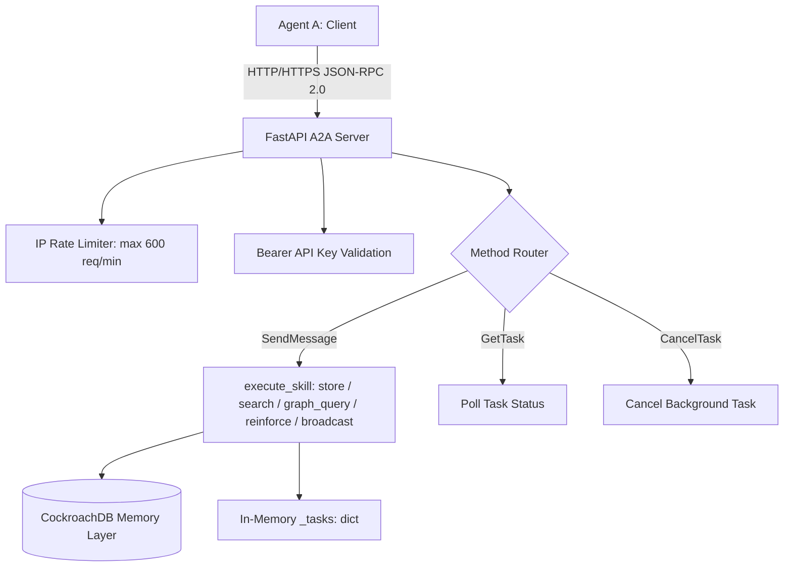

# Bastion A2A: Technical Audit, Research Synthesis, and World-Class Strategy

This document provides a deep architectural audit of Bastion's Agent-to-Agent (A2A) protocol implementation, compares it with emerging open standards, identifies critical production gaps, and details the roadmap to build a world-class, secure agent coordination network for the CockroachDB × AWS Hackathon.

---

## 1. Technical Audit of Bastion's Current A2A Server

Our A2A protocol implementation is defined in [a2a_server.py](file:///c:/projects/bastion/src/bastion/a2a_server.py) and verified in [test_a2a_server.py](file:///c:/projects/bastion/tests/test_a2a_server.py).

### System Data Flow


### Current Strengths
1.  **Standardized Interfaces:** Exposes the official A2A v1.0 specifications:
    *   `GET /.well-known/agent-card.json` (signed using an Ed25519 identity).
    *   `GET /.well-known/public-key.pem` (exposes our public key).
    *   `POST /` JSON-RPC endpoint supporting `SendMessage`, `GetTask`, and `CancelTask`.
2.  **Robust Routing Middleware:** Implements active IP-based rate limiting (sliding window), request size enforcement (1MB max), and Prometheus metrics (`/metrics`) recording request latency percentiles (p50, p90, p95, p99).
3.  **Cryptographic Identity:** Uses Ed25519 key-pair signatures to assert identity, preventing card impersonation.

---

## 2. Production Gaps: Why the Current A2A is Not World-Class

While the current codebase passes standard testing, it suffers from several production vulnerabilities:

### 1. In-Memory Task Store (High Disruption Risk)
*   **The Problem:** Task states and execution history are kept in a local RAM dictionary (`_tasks: dict` in `a2a_server.py:L199`).
*   **The Risk:** If the container crashes or restarts, all running/completed task logs vanish. Agents polling `GetTask` will receive a `404 Task not found` error (-32001). This directly violates CockroachDB's core theme of "persistent memory that survives outages."
*   **The Fix:** Write task states directly to a database-backed table (`a2a_tasks`) in CockroachDB, enabling multiple load-balanced instances of the A2A server to access consistent task histories.

### 2. Polling-Only Execution (Lack of Push Notifications)
*   **The Problem:** Currently, there is no real-time push mechanism for task completion. Calling agents are forced to continuously poll `GetTask`.
*   **The Risk:** Continuous polling causes unnecessary request amplification, rising token usage, and latency.
*   **The Fix:** Integrate standard webhook-based push notifications (`setTaskPushNotification`) triggered via CockroachDB CDC changefeeds to notify agents of task state transitions immediately.

### 3. One-Way Verification (Impersonation Vulnerability)
*   **The Problem:** Bastion signs its own Agent Card, but it **does not verify the signatures of incoming agent requests**.
*   **The Risk:** Any malicious client can spoof its headers and write poisoned memories into our database, bypassing authentication.
*   **The Fix:** Enforce cryptographic signature verification on all incoming `SendMessage` requests against the sender's public key (retrieved dynamically from their `.well-known/agent-card.json`).

---

## 3. Unified System Design: Bridging A2A and MCP

To win the hackathon, we will bridge A2A and MCP into a unified, secure agentic stack:

```
                  ┌──────────────────────────────────────────────┐
                  │                 AGENT CLIENT                 │
                  │    (Claude Desktop / Cursor / LangGraph)     │
                  └──────────────┬────────────────┬──────────────┘
                                 │                │
            JSON-RPC 2.0 (stdio) │                │ JSON-RPC 2.0 (SSE/HTTP)
                                 ▼                ▼
     ┌─────────────────────────────┐    ┌─────────────────────────────┐
     │       Bastion MCP Server    │    │      Bastion A2A Server     │
     │      (FastMCP Primitives)   │    │  (FastAPI + Ed25519 Keys)   │
     └──────────────┬──────────────┘    └──────────────┬──────────────┘
                    │                                  │
                    │   anyio.to_thread.run_sync()     │
                    └─────────────────┬────────────────┘
                                      │
                                      ▼
                        ┌─────────────────────────────┐
                        │      psycopg2 Conn Pool     │
                        └──────────────┬──────────────┘
                                       │
                                       ▼
    ┌───────────────────────────────────────────────────────────────────┐
    │                        COCKROACHDB CLUSTER                        │
    │  ┌──────────────────┐  ┌──────────────────┐  ┌──────────────────┐ │
    │  │   agent_memory   │  │    a2a_tasks     │  │   agent_audit    │ │
    │  │ (C-SPANN Vectors)│  │ (Persisted Logs) │  │ (Hash Chain Logs)│ │
    │  └────────┬─────────┘  └────────┬─────────┘  └──────────────────┘ │
    └───────────┼─────────────────────┼─────────────────────────────────┘
                │                     │
                │ CDC Changefeed      │ CDC Changefeed
                ▼                     ▼
    ┌───────────────────────────────────────────────────────────────────┐
    │                         AWS SERVICES LAYER                        │
    │  ┌──────────────────────────────────────────────────────────────┐ │
    │  │                       AWS Lambda Router                      │ │
    │  │  ┌───────────────────────────┬────────────────────────────┐  │ │
    │  │  │   A2A Webhook Push        │   S3 Audit Archiver        │  │ │
    │  │  └───────────────────────────┴────────────────────────────┘  │ │
    │  └──────────────────────────────────────────────────────────────┘ │
    └───────────────────────────────────────────────────────────────────┘
```

---

## 4. Shared CockroachDB Schema (Flawless Data Integration)

Both the MCP and A2A servers share a transactionally isolated database schema to keep state unified:

```sql
-- Existing Core Memory Table (Shared by MCP & A2A)
CREATE TABLE IF NOT EXISTS agent_memory (
    memory_id UUID PRIMARY KEY DEFAULT gen_random_uuid(),
    agent_id STRING NOT NULL,
    memory_type STRING NOT NULL,
    content STRING NOT NULL,
    embedding VECTOR(1024),
    metadata JSONB,
    previous_hash STRING,
    cryptographic_hash STRING,
    created_at TIMESTAMPTZ DEFAULT now(),
    expires_at TIMESTAMPTZ,
    access_count INT DEFAULT 0,
    importance_score FLOAT DEFAULT 5.0,
    trust_level INT DEFAULT 2,
    source_provenance STRING DEFAULT 'agent_direct',
    overwrite_count INT DEFAULT 0
);

-- NEW: Persisted A2A Task Table (Resolves A2A Memory Loss Gap)
CREATE TABLE IF NOT EXISTS a2a_tasks (
    task_id UUID PRIMARY KEY DEFAULT gen_random_uuid(),
    agent_id STRING NOT NULL,
    skill_id STRING NOT NULL,
    status STRING NOT NULL CHECK (status IN ('WORKING', 'COMPLETED', 'FAILED', 'CANCELED')),
    artifacts JSONB,
    callback_url STRING,
    created_at TIMESTAMPTZ DEFAULT now(),
    completed_at TIMESTAMPTZ,
    INDEX idx_a2a_status (status)
);
```

---

## 5. Technical Implementation Blueprint

### Step 1: Database-Backed Task Store & Groq Conflict Resolution
Replace the in-memory task dictionary in `a2a_server.py` with database execution blocks using `anyio.to_thread.run_sync()` to ensure tasks survive Vercel's serverless function lifecycle. Additionally, route concurrent multi-agent writes to the `groq_merge` callback to execute semantic conflict resolution entirely on Groq's free tier.

```python
# Shared Execution Pattern in a2a_server.py
import anyio

async def async_db_execute(func, *args, **kwargs):
    return await anyio.to_thread.run_sync(func, *args, **kwargs)

async def handle_send_message(params: dict, memory_client):
    task_id = str(uuid.uuid4())
    
    # 1. Log task starting
    await async_db_execute(
        db_store_task, task_id, params["agent_id"], "WORKING"
    )
    
    # 2. Run skill in thread executor
    try:
        result = await async_db_execute(
            run_skill, memory_client, params["skill_id"], params["args"]
        )
        # 3. Log task completed
        await async_db_execute(
            db_complete_task, task_id, "COMPLETED", result
        )
    except Exception as e:
        await async_db_execute(
            db_complete_task, task_id, "FAILED", {"error": str(e)}
        )
```

### Step 2: Request Signature Verification
Implement verification middleware to check incoming `SendMessage` payloads against the sender's public key to defend against **OWASP ASI06 (Memory Poisoning)**:

```python
def verify_incoming_message(payload: bytes, signature_base64: str, sender_pubkey_base64: str) -> bool:
    from cryptography.hazmat.primitives.asymmetric import ed25519
    import base64

    try:
        pubkey = ed25519.Ed25519PublicKey.from_public_bytes(base64.b64decode(sender_pubkey_base64))
        pubkey.verify(base64.b64decode(signature_base64), payload)
        return True
    except Exception:
        return False
```

### Step 3: Webhook Push Notification Dispatcher
Expose the standard `setTaskPushNotification` method:
1.  **Configure CockroachDB CDC Changefeed:**
    Create a changefeed tracking status updates on `a2a_tasks`:
    ```sql
    CREATE CHANGEFEED FOR TABLE a2a_tasks 
    INTO 'webhook-https://aws-lambda-endpoint/cdc-handler' 
    WITH updated, cursor;
    ```
2.  **AWS Lambda Dispatcher:**
    AWS Lambda processes the CDC event and POSTs task state transitions (e.g. status changes to `COMPLETED`) directly back to the registered agent's notification URL.

---

## 6. Production & Deployment Safeguards

To ensure the A2A server scales flawlessly in serverless environments:

### A. Connection Pool Sizing
*   **Problem:** High concurrency on Vercel spawns multiple serverless functions, which can exhaust CockroachDB's connection limits.
*   **Fix:** Force the connection pool settings in `config.py` to `min_size=1` and `max_size=2` per serverless instance to keep the cluster connection footprint safe.

### B. Cold Start Mitigation
*   **Problem:** Serverless functions scaling down to zero cause latency spikes (1.5s - 3s) for incoming agent requests, risking timeouts.
*   **Fix:** Implement a background AWS EventBridge Rule or cron job to hit the `/healthz` endpoint every 5 minutes, keeping Vercel routes warm.

### C. Webhook Retry Queuing
*   **Problem:** Callback delivery to `callback_url` fails if the recipient agent is offline.
*   **Fix:** Route CDC webhook events through an AWS SQS queue with an active Dead-Letter Queue (DLQ). Failed delivery triggers automatic exponential backoff retries (3 retries over 5 minutes) before marking the task notification as failed.

